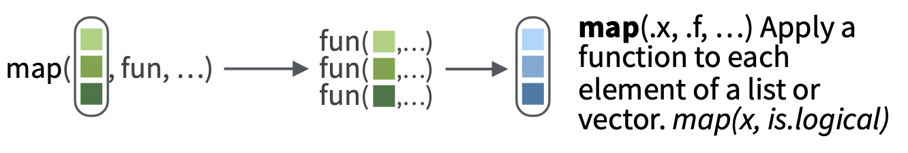
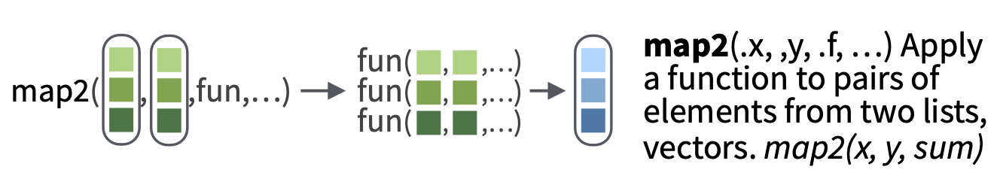

# 函數 {#function}

## 為什麼需要函數
在[R for Data Science](https://r4ds.had.co.nz/functions.html){target="_blank"}中提到，要變成傑出的資料科學家，學習如何撰寫函數（function）是非常好的方法，函數的優點包括：

- 使程式碼更好理解
- 若需修改程式碼，若有搭配function的使用，只需要修改函數中的程式碼，其他部分則維持原有叫用函數方式即可
- 程式碼可以重複使用

也因此，如果同一段程式碼已經被剪下貼上兩次，那就是寫一個函式(Function)的時機。

舉例來說，若我們要計算`iris`資料中`Sepal.Length`和`Sepal.Width`的比例，以及`Petal.Length`和`Petal.Width`的比例，並且四捨五入到小數點第一位，沒有使用函數的程式碼如下：
```{r}
round(iris$Sepal.Length/iris$Sepal.Width,1)[1:5]
round(iris$Petal.Length/iris$Petal.Width,1)[1:5]
```

每次計算都需指定 **,1** ，以完成四捨五入到小數點第一位的任務。

## 函數組成

要學習如何撰寫函數，首先須了解函數包含四個重要的部分:

- 名字 Function Name `function_name`
- 參數 Arguments, optional `arg_1, arg_2, ...`
- 程式碼本體 Function Body
- 回傳值 Return Value, optional `return_value`


```{r eval=F}
名字<-function(參數1,參數2,...){
  程式碼本體
  最後一行的輸出自動設為回傳值
}
```


而撰寫函數有四個重要步驟:

- 先寫出可以用的程式碼
- 將程式碼內可以重複使用的部分指派給臨時變數
- 其餘程式碼用臨時變數表示，讓程式碼變簡潔
- 把程式碼變成函數function

以常見的函數`mean()`為例，其實就是將輸入向量加總後，除以個數，完成平均值的計算
```{r}
mean(1:6)
```
```{r}
(1+2+3+4+5+6)/6
```
```{r}
sum(1:6)/length(1:6)
```

也因此，若我們想要自己撰寫一個計算平均值的函數`myMean()`，只要將上述邏輯寫入function內即可
```{r}
myMean<-function(vec){
    m<-sum(vec)/length(vec)
    return(m)
}
myMean(1:6)
myMean(2:10)
```

又以計算三次方為例，其實就是將輸入數字`x`自乘三次，程式碼如下：

```{r}
cube<-function(x){
    x_cube<-x*x*x
    return(x_cube)
}
cube(2)
cube(4)
cube(6)
```

## 函數命名原則
根據上述兩個簡單的函數，可以發現寫好的函數的方法是先確保程式的正確性，再確保函數是否容易閱讀與理解，為了達成函數的易理解性，函數有以下建議的命名原則:

- 長的函數名稱要遵循一樣的命名樣式
- 不要用原本就存在R中的函數名稱
- 可以被理解的名稱，通常是**動詞**

而參數也有對應的命名原則:

- 可以被理解的名稱
- 通常是**名詞**
- 輸入資料參數通常放在第一個
- 其他設定值通常會設定預設值

## 函數範例

接下來的範例使用兩個參數，`height`與`weight`，計算BMI值，並且考慮到輸入身高的單位可能會是公分的情況，邏輯為假設輸入的身高>5，因正常人身高不可能大於5公尺，因此假設輸入之單位為公分，需要在函數內將公分換算為公尺：
```{r}
cal_bmi<-function(height,weight){
    if(height>5){
        height <- height/100
    }
    bmi <- weight / height**2
    return(bmi)
}
cal_bmi(160,50)
cal_bmi(1.6,50)
```


## 函式編程Functional programming

函式編程（Functional programming）的技巧可以用在所有支援函數為一等公民（First Class）的程式語言，其中包括：

- 可以將函數指定為一個變數 Assign a function to a variable
- 可以將函數當作參數傳遞 Pass a function as an argument
- 可以回傳一個函數 Return a function

其中，可以將函數指定為一個變數在前述程式碼中其實已經出現過，在`cal_bmi` 函數中，我們就是將`cal_bmi` 變數設定為`cal_bmi`函數：
```{r}
cal_bmi<-function(height,weight){
    if(height>5){
        height <- height/100
    }
    bmi <- weight / height**2
    return(bmi)
}
cal_bmi(160,50)
cal_bmi(1.6,50)
```

而將函數當作參數並且傳遞的功能，在R中是非常實用且必須要學習的功能，在purrr[@R-purrr]套件中，此功能被大量應用。最後則是將函數回傳的功能，以下以`hello()`以及`sayHello()`函數為例，在`sayHello()`函數中，回傳值即為`hello()`函數。

```{r}
hello<-function(){
    print("Hello")
}
sayHello <- function() {
	return(hello())
}
sayHello()
```


## purrr
而上述支援函數為一等公民（First Class）的條件，最實用的應該為在`purrr`套件中，將函數當作參數傳遞，`purrr`套件提供一系列功能，將向量與函數的功能搭配，解決for迴圈速度很慢且程式碼很長的問題，在`purrr`套件中最重要的功能是`map`家族，包括map(), map_chr(), map_int(), map_dbl(), map_df(), walk()等，概念如下：

```{r echo=FALSE}

```

[圖片來源](https://github.com/rstudio/cheatsheets/blob/master/purrr.pdf)

以下為將學生成績開根號乘以10的函數，可以發現若輸入的原始成績是30分，輸出則是加分後的成績，若原始成績是50分，輸出成績就會及格，如果只是要算兩位同學的成績，一筆一筆輸入不是什麼大問題，但若要計算30名學生的成績，要打30次程式碼，還是非常麻煩的。

```{r}
good_teacher_score<-function(ori_score){
    better_score<-sqrt(ori_score)*10
    return(better_score)
}
good_teacher_score(30)
good_teacher_score(50)
```

以下為計算30個學生的成績時的程式碼，可以看到每筆成績都需要耗費一行程式碼來處理，十分麻煩。

```{r}
ori_score_list<-sample(1:100,30)
ori_score_list[1:3]
good_teacher_score(ori_score_list[1])
good_teacher_score(ori_score_list[2])
#.....
```

此時若能妥善利用`purrr`套件的`map_dbl`功能，就能將程式碼縮短，並且提升易讀性。map()函數家族的使用概念為`map(需逐一計算的向量,計算所需的函數)`，如下所示，我們需要計算的學生原始成績存在`ori_score_list`向量中，而加分的函數為`good_teacher_score()`：
```{r echo=FALSE}

```
[圖片來源](https://github.com/rstudio/cheatsheets/blob/master/purrr.pdf)

學生原始成績存在ori_score_list變數內：
```{r}
ori_score_list
```

使用`map_dbl`將每位學生的成績加分：
```{r}
library(purrr)
new_score_list<-
    map_dbl(ori_score_list,
            good_teacher_score)

```
```{r eval=F}
data.frame(ori_score_list,
           new_score_list)
```
```{r echo=F}
knitr::kable(data.frame(ori_score_list,
           new_score_list))
```

使用`map`函數即可完成逐一計算向量中原始成績的任務。


## map2 family

map函數的設計是輸入一組需逐一計算的向量，但有時我們需要兩組成對且需逐一計算的向量，這時就可以使用`map2`家族函數，概念為輸入兩組成對且需逐一計算的向量，成對帶入後置函數內，完成計算。
```{r echo=FALSE}

```
```{r echo=FALSE}

```

[圖片來源](https://github.com/rstudio/cheatsheets/blob/master/purrr.pdf)

以計算加權成績為例，我們有一組學生的國文成績chi_score以及英文成績eng_score，並且希望將這些成績以（國文成績+2*英文成績）的方式做加權計算，首先，我們須先將加權的程式碼撰寫成`weight_score()`函數，並使用`map2`家族函數，完成逐一計算的任務。`map2`家族函數的使用方法為`map2_dbl(需逐一計算的向量1,需逐一計算的向量2,計算所需的函數)`。

首先建立國文成績chi_score以及英文成績eng_score向量：
```{r}
chi_score<-c(60,50,40)
eng_score<-c(60,50,40)
```

完成向量值的指定後，撰寫（國文成績+2*英文成績）加權計算函數`weight_score()`：
```{r}
weight_score<-function(chi,eng){
    final_score<-chi+eng*2
    return(final_score)
}
```

使用`map2`家族函數，完成逐一計算的任務：
```{r}
weight_score_list<-
    map2_dbl(chi_score,
             eng_score,
            weight_score)

```
```{r eval=F}
data.frame(chi_score,
           eng_score,
           weight_score_list)
```
```{r echo=F}
knitr::kable(data.frame(chi_score,
           eng_score,
           weight_score_list))
```


## 參考資料

- [R for Data Science](https://r4ds.had.co.nz/functions.html){target="_blank"}
- [Advanced R](https://adv-r.hadley.nz/functionals.html){target="_blank"}
- [purrr package](https://purrr.tidyverse.org/){target="_blank"}
