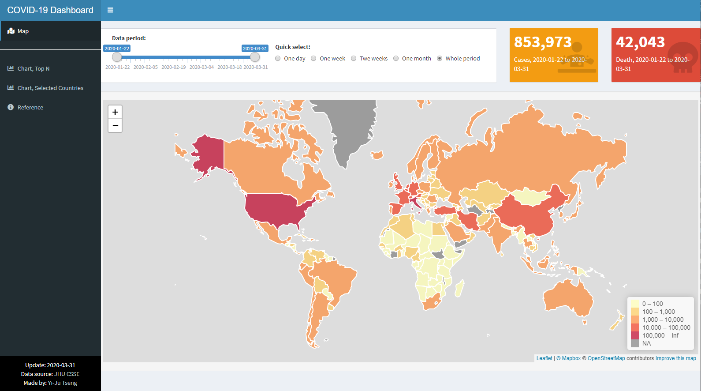

# 互動式資料呈現 {#InteractiveGraphics}

在R中有多種互動式資料呈現方式，除了傳統的`GGobi`、`iPlots`、`identify`等套件外，結合網頁呈現的互動畫呈現方式有更多的彈性，以下介紹幾種好用的互動式套件：

- ggvis
- googleVis
- Plot.ly

使用者可依需求選擇使用。

最後再介紹Shiny，一個RStudio推出供R語言使用的網頁應用框架，使用者可以將做好的互動式圖表用Shiny部署網頁，並將分析結果以網頁的方式分享給別人。

## ggvis

ggvis[@R-ggvis] 是RStudio開發的互動式繪圖套件，繪圖語法與ggplot2[@R-ggplot2]套件類似，基本概念是使用R做資料處理與分析，然後利用網頁的方式做視覺化呈現。如果使用RStudio IDE，透過ggvis套件畫的圖會呈現在右下角的**Viewer**視窗中。

使用ggvis套件時，必須先安裝與載入
```{r ggvisInstall, eval=F, message=F}
install.packages("ggvis")
```
```{r ggvisLoad, message=F}
library(ggvis)
```
```{r ggvis1, message=F}
p <- ggvis(mtcars, x = ~wt, y = ~mpg)
layer_points(p)
```

增加`input_slider`函數，讓使用者可以調整圖形畫圖方式（因書本輸出格式，不支援動態畫圖，請將程式碼複製貼上到RStudio中就能看到互動式畫圖的樣子）
```{r ggvis2, message=F}
p<-ggvis(mtcars,~wt)
layer_histograms(p,width =  input_slider(0, 2, step = 0.10, label = "width"),
                   center = input_slider(0, 2, step = 0.05, label = "center"))
```

除了`input_slider()`外，ggvis還提供以下互動式輸入介面：

- input_checkbox()
- input_checkboxgroup()
- input_numeric()
- input_radiobuttons()
- input_select()
- input_text()

其他詳細使用說明請參考[官網](http://ggvis.rstudio.com/){target="_blank"}

##googleVis
googleVis[@R-googleVis] package是基於[Google Chart API](https://developers.google.com/chart/interactive/docs/){target="_blank"}開發的R套件，使用前需要先安裝與載入。

```{r googlevisInstall, eval=F, message=F}
install.packages("googleVis")
```

```{r googlevisLoad, message=F}
library(googleVis)
```

如果想要一次看完所有作圖範例，可用以下指令（執行完畢需要一點時間）
```{r googlevisDemo, eval=F, message=F}
demo(googleVis)
```

googleVis套件提供多種繪圖方式，包括：

- 一維資料做圖
    - gvisHistogram
  
- 類別-數值資料做圖
    - gvisPieChart
    - gvisGauge
    - gvisBarChart
    - gvisColumnChart
    - gvisCandlestickChart
  
- 數值-數值資料做圖
    - gvisLineChart
    - gvisAreaChart
    - gvisSteppedAreaChart
    - gvisScatterChart
    - gvisAnnotationChart
  
- 數值-數值-數值資料做圖
    - gvisBubbleChart

- 地圖相關
    - gvisIntensityMap
    - gvisGeoChart
    - gvisMap
  
- 其他圖形
    - gvisOrgChart
    - gvisTreeMap
    - gvisSankey
    - gvisComboChart
    - gvisCalendar
    - gvisTimeline

詳細使用說明請參考[googleVis套件說明](https://cran.r-project.org/web/packages/googleVis/vignettes/googleVis_examples.html){target="_blank"}

```{r googlevis1, message=F}
df=data.frame(country=c("US", "GB", "BR"), 
              val1=c(10,13,14), 
              val2=c(23,12,32))
Line <- gvisLineChart(df)
plot(Line)
```

```{r googlevis2, message=F}
require(datasets)
states <- data.frame(state.name, state.x77)
GeoStates <- gvisGeoChart(states, "state.name", "Illiteracy",
                          options=list(region="US", 
                                       displayMode="regions", 
                                       resolution="provinces",
                                       width=600, height=400))
plot(GeoStates)
```

```{r googlevis3, message=F}
AndrewMap <- gvisMap(Andrew, "LatLong" , "Tip", 
                     options=list(showTip=TRUE, 
                                  showLine=TRUE, 
                                  enableScrollWheel=TRUE,
                                  mapType='terrain', 
                                  useMapTypeControl=TRUE))
plot(AndrewMap)
```

其他Google Chart可以做的圖形種類，可以參考[Chart Gallery](https://developers.google.com/chart/interactive/docs/gallery){target="_blank"}

## Plot.ly
[Plotly](https://plot.ly/){target="_blank"}是一個線上分析與視覺化的工具，如需線上作圖，可至https://plot.ly/create/ 建立帳號並開始作圖。Plotly也**提供套件R使用**，使用者可以透過安裝plotly[@R-plotly] package在R中畫基於**Plotly.js** (**d3.js ** + **stack.gl**)的圖表和地圖。除了R的套件外，還有Python, MATLAB, Perl, Julia, Arduino等套件可供使用。

使用plotly套件時，必須先安裝與載入
```{r plotlyInstall, eval=F, message=F}
install.packages("plotly")
```
```{r plotlyLoad, message=F}
library(plotly)
```

```{r plotly1, message=F}
d <- diamonds[sample(nrow(diamonds), 1000), ]
plot_ly(d, x = ~carat, y = ~price, color = ~carat,
        size = ~carat, text = ~paste("Clarity: ", clarity))
```

```{r plotly2, message=F,warning=F}
p <- ggplot(data = d, aes(x = carat, y = price)) +
  geom_point(aes(text = paste("Clarity:", clarity))) +
  geom_smooth(aes(colour = cut, fill = cut)) + facet_wrap(~ cut)
ggplotly(p)
```

Plotly提供免費的圖形分享空間，方便使用者將做好的圖上傳到網路上，若想使用Plotly提供圖形分享空間，必須要先申請Plotly帳號，透過[此網頁](https://plot.ly/settings/api)取得API keys，並使用下列程式碼設定帳號與API keys
```{r setPlotly, eval=F, message=F}
Sys.setenv("plotly_username"="your_plotly_username")
Sys.setenv("plotly_api_key"="your_api_key")
```

設定完基本資料後，使用`plotly_POST`函式將plotly物件`p`上傳到指定路徑(`filename`)的網路空間中。
```{r postPlotly, eval=F, message=F}
plotly_POST(p, filename = "file-name")
```

參考資料

- [Plotly官網](https://plot.ly/){target="_blank"}
- [Plotly API for R](https://plot.ly/r/){target="_blank"}
- [Plotly cheat sheet](https://images.plot.ly/plotly-documentation/images/r_cheat_sheet.pdf){target="_blank"}


## Shiny簡介
Shiny是RStudio推出供R語言使用的網頁應用框架（Web application framework），透過Shiny，使用者可以輕鬆地將資料分析結果轉換成互動式的網頁應用，不用另外學習其他網頁程式語言（如HTML, CSS, JavaScript等），若要使用Shiny，RStudio IDE提供完整測試預覽功能，建議一起使用。使用前必須先安裝並載入`shiny` [@R-shiny] package

```{r shinyInstall, eval=F, message=F}
install.packages("shiny")
```
```{r shinyLoad, message=F}
library(shiny)
```

shiny package內提供11個網頁部署範例，使用者可以直接用下列程式碼觀看相關範例的呈現效果與原始碼
```{r shinyEx, eval=F, message=F}
runExample("01_hello") # a histogram
runExample("02_text") # tables and data frames
runExample("03_reactivity") # a reactive expression
runExample("04_mpg") # global variables
runExample("05_sliders") # slider bars
runExample("06_tabsets") # tabbed panels
runExample("07_widgets") # help text and submit buttons
runExample("08_html") # Shiny app built from HTML
runExample("09_upload") # file upload wizard
runExample("10_download") # file download wizard
runExample("11_timer") # an automated timer
```

在RStudio內，可直接透過新增專案 **New Project**新增Shiny應用程式

```{r echo=FALSE}
knitr::include_graphics("figure/shiny1.png")
```

```{r echo=FALSE}
knitr::include_graphics("figure/shiny2.png")
```

```{r echo=FALSE}
knitr::include_graphics("figure/shiny3.png")
```

```{r echo=FALSE}
knitr::include_graphics("figure/shiny4.png")
```


Shiny應用程式包括兩個元件：

  - **ui.R** : 使用者介面（前端）程式碼 user-interface script
  - **server.R** : 伺服器端（後端）程式碼 server script

使用者介面程式碼**ui.R**控制Shiny應用程式的外觀，伺服器端程式碼**server.R**控制Shiny應用程式的功能。

**ui.R範例**
```{r ui, eval=F, message=F}
library(shiny)

shinyUI(fluidPage(

  # 網頁標題
  titlePanel("Hello Shiny!"),

  # Sidebar + slider
  sidebarLayout(
    sidebarPanel(
      sliderInput("bins",
                  "Number of bins:",
                  min = 1,
                  max = 50,
                  value = 30)
    ),

    # 圖形呈現
    mainPanel(
      plotOutput("distPlot")
    )
  )
))
```

**server.R範例**
```{r server, eval=F, message=F}
library(shiny)

shinyServer(function(input, output) {

 
  # 將直方圖Histogram存入distPlot變數，在UI端用plotOutput呈現
  output$distPlot <- renderPlot({
    x  <- faithful[, 2]  # Old Faithful Geyser data
    # input$bins是用UI端的Sidebar + slider調整
    bins <- seq(min(x), max(x), length.out = input$bins + 1)
    hist(x, breaks = bins, col = 'darkgray', border = 'white')
  })
})
```

若想使用介紹過的Plotly與Shiny結合，可參考[此教學網頁](https://plot.ly/r/shiny-tutorial/){target="_blank"}。

更深入的Shiny教學，可參考[使用R Shiny設計資料科學應用程式](https://yjtseng.info/shinybook/){target="_blank"}，為專為Shiny App開發撰寫的電子書，並[深入解說](https://yjtseng.info/shinybook/covid19){target="_blank"}**如何使用Shiny建立新冠肺炎COVID-19的案例數地圖與儀表板**。


```{r echo=FALSE}

```

參考資料

- [Shiny官網](http://shiny.rstudio.com/){target="_blank"}
- [Shiny cheat sheet](https://www.rstudio.com/wp-content/uploads/2016/01/shiny-cheatsheet.pdf){target="_blank"}


