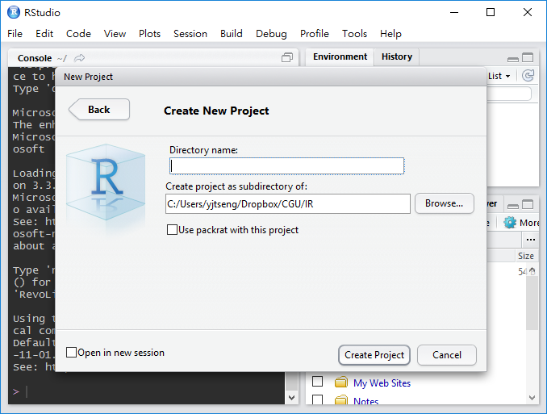
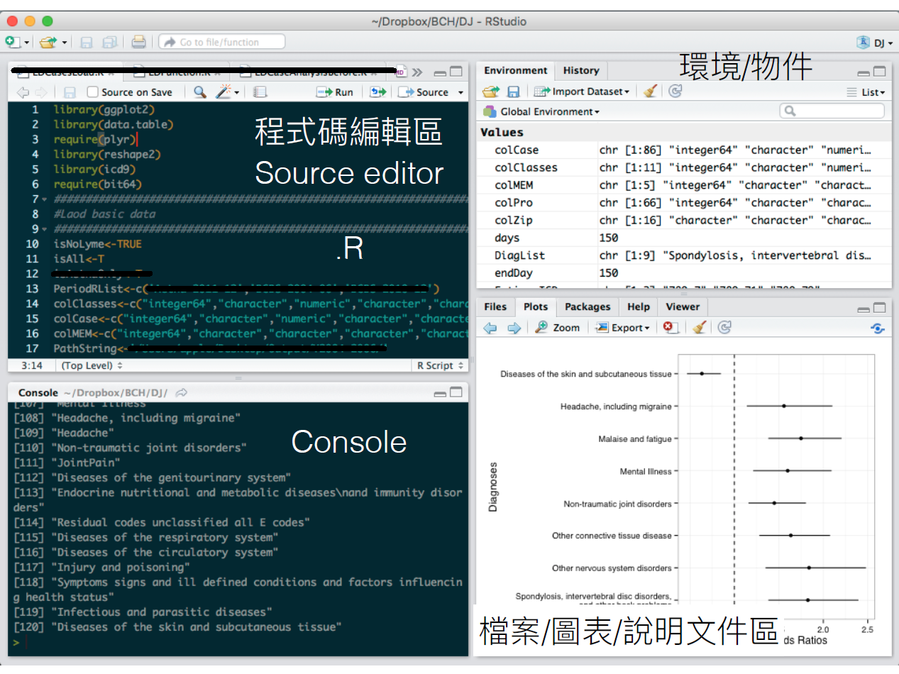

# 軟體安裝介紹 {#install}
本章節將介紹R與RStudio的安裝與基本使用方式

## R安裝
[R語言](http://www.r-project.org/){target="_blank"}是一種自由軟體程式語言，主要用於資料分析與統計運算，2000年時終於發表R 1.0.0，有關R語言的發展歷史可參考[維基百科](https://zh.wikipedia.org/wiki/R%E8%AF%AD%E8%A8%80){target="_blank"}。

安裝步驟如下: 

**Step 1. 從R的官網下載安裝檔**

- 進入R官網 https://www.r-project.org/ 
- 選擇**Download**下方的**CRAN**連結
- 進入CRAN子網頁後，請選擇離所在地最近的載點，以臺灣桃園為例，可選擇元智大學 (	Department of Computer Science and Engineering, Yuan Ze University) 的載點。

進入下載網頁後，可看到多個選項:

- Download R for Linux
- Download R for (Mac) OS X
- Download R for Windows

依作業系統選擇適當連結後，點選**base** (Binaries for base distribution)，下載最新版本的R安裝檔。

**Step 2. 依安裝檔指示完成安裝**

## RStudio安裝
[RStudio](https://www.rstudio.com/){target="_blank"}是R語言的IDE，屬於免費自由軟體，提供一般桌面板與伺服器版，以下介紹桌面板安裝方式，伺服器版安裝可參考Chapter \@ref(big)。

**Step 1. 從RStudio的官網下載安裝檔**

- 進入RStudio官網 https://www.rstudio.com/ 
- 選擇網頁上方**Products**連結內的**RStudio**
- 選擇**Desktop**版本
- 點選**Open Source Edition**下方的**DOWNLOAD RSTUDIO DESKTOP**
- 點選RStudio Desktop Open Source License下方的**DOWNLOAD**

選單中會出現多種作業系統版本，以RStudio 1.0.136為例，各作業系統版本如下

- RStudio 1.0.136 - Windows Vista/7/8/10	
- RStudio 1.0.136 - Mac OS X 10.6+ (64-bit)	
- RStudio 1.0.136 - Ubuntu 12.04+/Debian 8+ (32-bit)
- RStudio 1.0.136 - Ubuntu 12.04+/Debian 8+ (64-bit)
- RStudio 1.0.136 - Fedora 19+/RedHat 7+/openSUSE 13.1+ (32-bit)
- RStudio 1.0.136 - Fedora 19+/RedHat 7+/openSUSE 13.1+ (64-bit)	

依作業系統選擇適當連結

**Step 2. 依安裝檔指示完成安裝**

## RStudio使用簡介


### 專案
RStudio引進專案(Project)的概念，幫助使用者管理同一專案之R程式碼檔案，同時完成工作路徑的設定 (設定為專案所在資料夾)。除快速測試外，建議一開始就以專案形式新增R程式碼。

以本課程為例，開啟RStudio視窗後，可在左上**File**選項中選擇**New Project**後，依需求選擇**New Directory**或**Existing Directory**

```{r echo=FALSE}
knitr::include_graphics("figure/NewProject.png")
```

若選擇的是**New Directory**，則會出現下列三個選項

- Empty Project
- R Package
- Shiny Web Application

若是新增一般分析專案，選擇**Empty Project**後，輸入**專案路徑**與**專案名稱**，完成專案新增。

```{r echo=FALSE}

```

完成專案新增後，在專案內新增R程式碼檔案(File -> New file -> R Script)後，**程式碼編輯區 Source editor**就會出現在左上角。


### RStudio介面
RStudio的介面共有四個區塊，分別為

- 程式碼編輯區 Source editor
- 執行視窗 Console
- 環境/物件
- 檔案/圖表/說明文件

剛開啟一個新的RStudio視窗時不會有**程式碼編輯區 Source editor**，必須要新增專案後才會出現。

```{r echo=FALSE}

```

建議使用方式如下:

- 在左上方**程式碼編輯區 Source editor**撰寫程式碼
- 完成程式碼撰寫後，將需要執行的程式碼反白，點選**Run** (見下圖)，執行程式碼
- 除了反白外，將游標移至需要執行的程式碼，，點選**Run** (見下圖)也可執行該行程式碼
- 程式碼會在左下方Console視窗執行，顯示結果
- 如果有畫圖，會出現在右下方視窗
- 可在右上方視窗檢查所有變數

```{r echo=FALSE}
knitr::include_graphics("figure/ed.png")
```

RStudio的其他使用細節，可參考[RStudio IDE Cheat Sheet](https://www.rstudio.com/wp-content/uploads/2016/01/rstudio-IDE-cheatsheet.pdf){target="_blank"}
